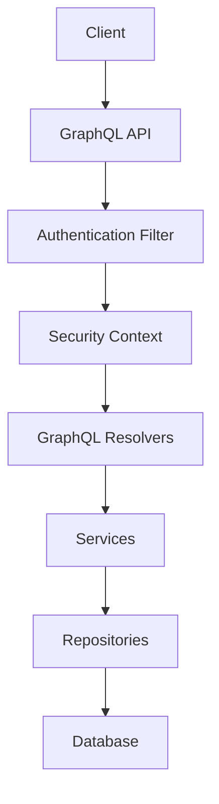
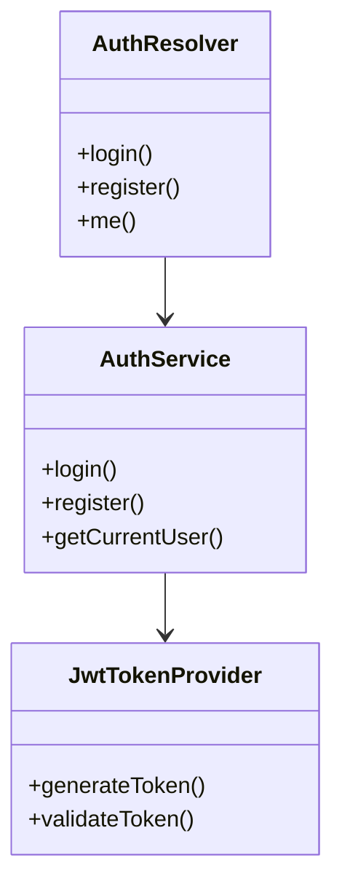
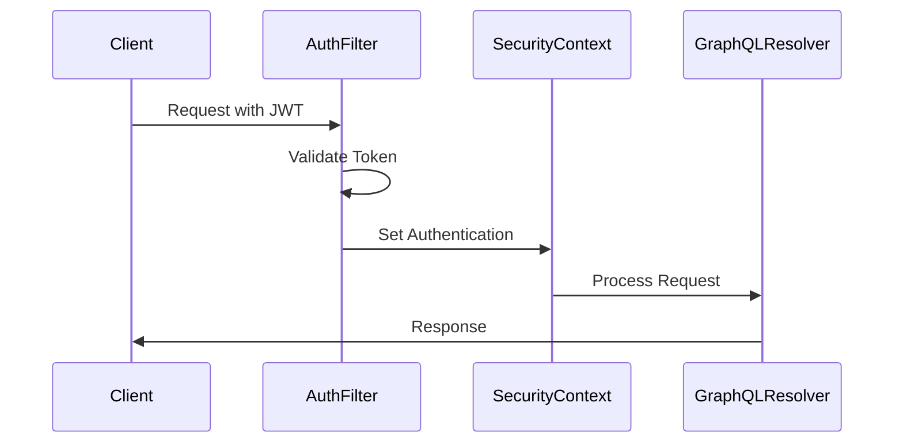

# Lorem Gateway

A GraphQL-based API gateway built with Spring Boot, WebFlux, and R2DBC for handling car-related transactions and user management.

## Table of Contents
- [Features](#features)
- [Tech Stack](#tech-stack)
- [Prerequisites](#prerequisites)
- [Environment Setup](#environment-setup)
- [Running the Application](#running-the-application)
- [API Documentation](#api-documentation)
- [Architecture](#architecture)
- [Security](#security)
- [Logging](#logging)

## Features
- GraphQL API with WebFlux
- JWT-based Authentication
- Reactive Database Access with R2DBC
- Correlation ID Tracking
- Multi-environment Support
- Comprehensive Logging

## Tech Stack
- Java 20
- Spring Boot 3.2.3
- Spring WebFlux
- Spring Security
- Spring GraphQL
- R2DBC
- PostgreSQL/H2
- JWT
- Project Lombok
- Maven

## Prerequisites
- Java 20
- Maven
- PostgreSQL (for dev/prod)
- Docker (optional)

## Environment Setup

### Local Environment
```yaml
# application-local.yml
spring:
  r2dbc:
    url: r2dbc:h2:mem:///testdb
    username: sa
    password: 
```

### Development Environment
```yaml
# application-dev.yml
spring:
  r2dbc:
    url: r2dbc:postgresql://localhost:5432/lorem_gateway
    username: ${DB_USERNAME:postgres}
    password: ${DB_PASSWORD:postgres}
```

## Running the Application

### Local Profile
```bash
./mvnw spring-boot:run -Dspring.profiles.active=local
```

### Development Profile
```bash
export DB_USERNAME=your_username
export DB_PASSWORD=your_password
./mvnw spring-boot:run -Dspring.profiles.active=dev
```

## API Documentation

### Authentication

#### Register User
```graphql
mutation {
  register(email: "user@example.com", password: "password", name: "John Doe") {
    token
    user {
      id
      email
      name
    }
  }
}
```

#### Login
```graphql
mutation {
  login(email: "user@example.com", password: "password") {
    token
    user {
      id
      email
      name
    }
  }
}
```

### Car Management

#### Create Car
```graphql
mutation {
  createCar(input: {
    vin: "ABC12345678901234"
    make: "Toyota"
    model: "Camry"
    year: 2020
    mileage: 50000.0
    mileageUnit: "KM"
    color: "Silver"
    registrationNumber: "KA01AB1234"
  }) {
    id
    vin
    make
    model
  }
}
```

#### Update Car Status
```graphql
mutation {
  updateCarStatus(id: "uuid", status: AVAILABLE) {
    id
    status
  }
}
```

### Transaction Management

#### Create Transaction
```graphql
mutation {
  createTransaction(input: {
    carId: "uuid"
    buyerId: "uuid"
    amount: 25000.00
    paymentMethod: "BANK_TRANSFER"
  }) {
    id
    status
    amount
  }
}
```

## Architecture

### Flow Diagram


### Class Flow


## Security

### Authentication Flow

#### JWT Token Generation
1. User registers or logs in
2. System validates credentials
3. JWT token is generated with:
   - User details (email, roles)
   - Expiration time (24 hours)
   - Issuer and audience claims

#### Token Structure
```json
{
  "sub": "user@example.com",
  "roles": ["USER"],
  "iat": 1234567890,
  "exp": 1234651290
}
```

#### Authentication Process


#### Secure Endpoints
All mutations (except login/register) require authentication:
```java
@PreAuthorize("isAuthenticated()")
public Mono<Car> createCar(...) { ... }
```

#### Token Usage
1. Include token in Authorization header:
```
Authorization: Bearer <jwt_token>
```

2. Token is validated by:
   - JwtAuthenticationFilter
   - JwtTokenProvider
   - SecurityContext

#### Error Handling
- Invalid token: 401 Unauthorized
- Expired token: 401 Unauthorized
- Missing token: 401 Unauthorized
- Invalid credentials: 400 Bad Request

### CORS Configuration
- Enabled for GraphQL endpoints
- Configurable per environment

## Logging

### Log Levels
- DEBUG: Application and GraphQL components
- INFO: Security and web components
- TRACE: SQL operations (dev only)

### Correlation ID
- Automatically generated for each request
- Propagated through reactive chains
- Included in all log messages

## Contributing
1. Fork the repository
2. Create your feature branch
3. Commit your changes
4. Push to the branch
5. Create a Pull Request

## License
This project is licensed under the MIT License. 